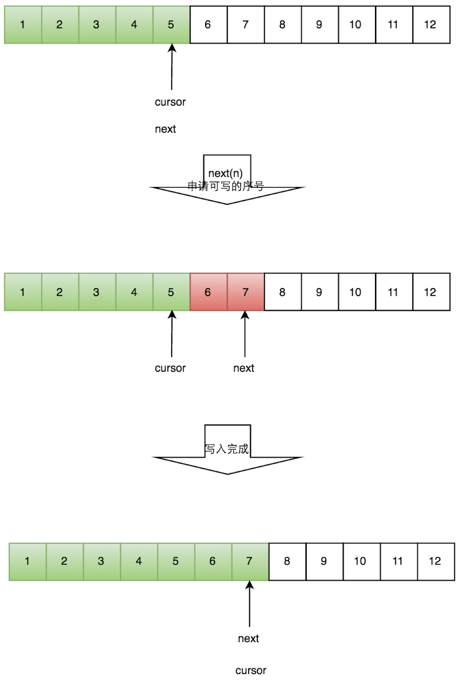

# test-disruptor
test Disruptor

## reference

[高性能队列——Disruptor](https://tech.meituan.com/2016/11/18/disruptor.html)

## 高性能队列 - Disruptor

Disruptor通过以下设计来解决队列速度慢的问题：

环形数组结构：为了避免垃圾回收，采用数组而非链表。同时，数组对处理器的缓存机制更加友好。

元素位置定位：数组长度2^n，通过位运算，加快定位的速度。下标采取递增的形式。不用担心index溢出的问题。index是long类型，即使100万QPS的处理速度，也需要30万年才能用完。

无锁设计：每个生产者或者消费者线程，会先申请可以操作的元素在数组中的位置，申请到之后，直接在该位置写入或者读取数据。

下面忽略数组的环形结构，介绍一下如何实现无锁设计。整个过程通过原子变量CAS，保证操作的线程安全。


>队列分为几种不同的模型：
>1. 单生产者单消费者
>2. 单生产者多消费者
>3. 多生产者单消费者
>4. 多生产者多消费者

我们将以生产者、消费者的维度来理解 disruptor 的实现方式：

>我们分为三个不同的情形：
>1. 单生产者
>2. 多消费者
>3. 多生产者

### 单生产者

>- `cursor` 表示当前数据所处的位置
>- `next` 表示队列当前已经分配的位置



1. > 1. 使用 `next(n)` 在队列中申请slot；
   > 2. `next` 变量往后移动分配slot，并且此时会检查环形队列是否有足够的slot；
   > 3. 返回 `true` 则开始写入；

### 多个生产者

> - `RingBuffer` 代表环形队列；
> - `availableBuffer` 表示数据已经写入成功的 slot；
> - `next` 表示队列当前已经分配的位置；
> - `reader cursor` 表示读取数据的指针；
> - `writer1`、`writer2`、`writer3` 代表三个写入线程；
> - `writer cursor` 表示当前已经分配好的 slot （只是分配好，不代表已经写入完成可读）；


#### **写数据**

> 1. 某个线程获取 `cursor` 当前值，并且修改为 `current + n`；
> 2. 在 `while` 循环中使用 `compareAndSet` 修改当前的 `cursor`  直到将 `[cursor, cursor + n)` 这段空间分配给某一个线程；
> 3. 当线程申请完空间之后，它在当前给他分配的slot中执行写操作即可；但是多线程写入面临一个问题，每个线程分段写入，**writer cursor 指向的位置，并不保证之前所有的 slot 都已经正常写入数据。**
>
> ```java
> public long tryNext(int n) throws InsufficientCapacityException
> {
>     if (n < 1)
>     {
>         throw new IllegalArgumentException("n must be > 0");
>     }
>  
>     long current;
>     long next;
>  
>     do
>     {
>         current = cursor.get();
>         next = current + n;
>  
>         if (!hasAvailableCapacity(gatingSequences, n, current))
>         {
>             throw InsufficientCapacityException.INSTANCE;
>         }
>     }
>     while (!cursor.compareAndSet(current, next));
>  
>     return next;
> }
> ```

#### **读数据**

> 1. 申请读取序号 n；
> 2. 如果 `writer cursor` >= `n` 此时仍然无法确定最大可读取的数据，因为我们是多线程分段写入；此时需要检查 `availableBuffer`，找到最大的可读序号；
> 3. 根据返回的最大刻度序号读取数据。

.png)

### 实例

> **`disruptor` 会在初始化的时候预先分配所有资源，并初始化所有slot内的data。**
>
> 可以看到，`disruptor` 的使用步骤如下：
>
> 1. 创建 `ThreadFactory` 用于为disruptor的processor提供处理线程；
> 2. 创建 `EventFactory` 为 `RingBuffer` 初始化所有的元素；
> 3. 创建 `EventHandler` 为 `RingBuffer` 添加元素时执行回调；
> 4. 随后，可以通过 `publish` 发布数据；

```java
public class Example {

    private ThreadFactory newThreadFactory() {
        /*
         * 生产者的线程工厂
         */
        return new ThreadFactoryBuilder().setNameFormat("disruptor-thread-%d").build();
    }

    private EventFactory<Element<String>> newEventFactory() {
        /*
         * RingBuffer生产工厂,初始化RingBuffer的时候使用
         */
        return () -> {
            Element<String> element = new Element<>();
            element.setValue("default");
            return element;
        };
    }

    private EventHandler<Element<String>> newEventHandler() {
        /*
         * 处理Event的handler
         */
        return (element, sequence, endOfBatch) -> System.out.println("Element: " + element.getValue());
    }

    private RingBuffer<Element<String>> startDisruptor() {
        ThreadFactory                 threadFactory = newThreadFactory();
        EventFactory<Element<String>> eventFactory  = newEventFactory();
        EventHandler<Element<String>> eventHandler  = newEventHandler();
        // 阻塞策略
        BlockingWaitStrategy strategy = new BlockingWaitStrategy();

        // 指定RingBuffer的大小
        int bufferSize = 16;

        // 创建disruptor，采用单生产者模式
        Disruptor<Element<String>> disruptor = new Disruptor<Element<String>>(eventFactory,
                                                                              bufferSize,
                                                                              threadFactory,
                                                                              ProducerType.SINGLE,
                                                                              strategy);
        // 设置EventHandler
        disruptor.handleEventsWith(eventHandler);
        // 启动disruptor的线程
        return disruptor.start();
    }

    public static void main(String[] args) throws Exception {
        Example example = new Example();
        example.startWithPublish();
    }
}
```

> 基于 `get` 和 `publish` 的实现

```java
    private void startWithPublish() throws InterruptedException {
        RingBuffer<Element<String>> ringBuffer = startDisruptor();
        while (true) {
            // 获取下一个可用位置的下标
            long sequence = ringBuffer.next();
            try {
                // 返回可用位置的元素
                Element<String> event   = ringBuffer.get(sequence);
                String          current = event.getValue();
                current += "-" + sequence;
                event.setValue(current);
            } finally {
                ringBuffer.publish(sequence);
            }
            Thread.sleep(500);
        }
    }

```

```
Element: default-0
Element: default-1
Element: default-2
Element: default-3
Element: default-4
Element: default-5
Element: default-6
Element: default-7
Element: default-0-8
Element: default-1-9
Element: default-2-10
Element: default-3-11
Element: default-4-12
Element: default-5-13
Element: default-6-14
```

> 基于 `tryPublishEvent` 的实现

```java
    private void startWithPublishEvent() throws InterruptedException {
        RingBuffer<Element<String>> ringBuffer = startDisruptor();
        for (int i = 0; true; ++i) {
            long current = ringBuffer.getCursor();
            Element<String> element = ringBuffer.get(current);
            System.out.println("element: " + element.getValue() + ", current = " + current);
            ringBuffer.tryPublishEvent(translator, String.valueOf(i));
            Thread.sleep(500);
        }
    }
```

```
element: -1, current = -1
Element: 0
element: 0, current = 0
Element: 1
element: 1, current = 1
Element: 2
element: 2, current = 2
Element: 3
element: 3, current = 3
Element: 4
element: 4, current = 4
Element: 5
element: 5, current = 5
Element: 6
element: 6, current = 6
Element: 7
element: 7, current = 7
Element: 8
element: 8, current = 8
Element: 9
element: 9, current = 9
Element: 10
element: 10, current = 10
Element: 11
element: 11, current = 11
Element: 12
element: 12, current = 12
Element: 13
element: 13, current = 13
Element: 14
element: 14, current = 14
Element: 15
element: 15, current = 15
Element: 16
```


